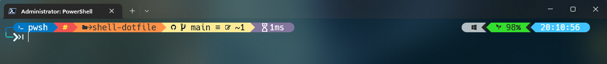

# My PowerShell dotfiles

Set-up for the Windows PowerShell prompt with [Oh My Posh](https://github.com/JanDeDobbeleer/oh-my-posh) and [Scoop](https://github.com/ScoopInstaller/Scoop).

For a tutorial on how to configure the patched [nerd fonts](https://github.com/ryanoasis/nerd-fonts) and a UNIX-like transparent / acrylic background, check out this [devaslife](https://www.youtube.com/watch?v=5-aK2_WwrmM) video.

Bonus: Oh My Posh configuration for the Windows WSL subsystem.



## Content

* PowerShell config
    * Profile
    * Theme ([atomic](https://github.com/JanDeDobbeleer/oh-my-posh/blob/main/themes/atomic.omp.json) modded)

```
.
└── .config
    ├── powershell
    |   ├── my_profile.ps1
    |   └── my_theme.omp.json 
    └── bash
```

# Configure

## PowerShell setup

Scoop installation (for admin installation check out [this](https://github.com/ScoopInstaller/Install#for-admin)):
```
iwr -useb get.scoop.sh | iex
```

Installing Git:
```
winget install -e --id Git.Git
```

Installing Neovim with Scoop:
```
scoop install neovim gcc
```

Installing Oh My Posh:
```
scoop install https://github.com/JanDeDobbeleer/oh-my-posh/releases/latest/download/oh-my-posh.json
scoop update oh-my-posh
```

Setting up the custom profile as the CurrentUserCurrentHost profile (for further details about profiles, visit the [Microsoft website](https://docs.microsoft.com/en-us/powershell/module/microsoft.powershell.core/about/about_profiles?view=powershell-7.2)):
```
nvim $PROFILE.CurrentUserCurrentHost
```

Modify the profile adding this command (be sure to include **the correct path**):
```
. $env:USERPROFILE\PATH\TO\.config\powershell\my_profile.ps1
```

## WSL Bash setup

Installing Oh My Posh:
```
sudo wget https://github.com/JanDeDobbeleer/oh-my-posh/releases/latest/download/posh-linux-amd64 -O /usr/local/bin/oh-my-posh
sudo chmod +x /usr/local/bin/oh-my-posh
```

```
mkdir ~/.poshthemes
wget https://github.com/JanDeDobbeleer/oh-my-posh/releases/latest/download/themes.zip -O ~/.poshthemes/themes.zip
unzip ~/.poshthemes/themes.zip -d ~/.poshthemes
chmod u+rw ~/.poshthemes/*.omp.*
rm ~/.poshthemes/themes.zip
```

Changing permission for Oh My Posh:
```
cd /usr/local/bin
sudo chmod 755 oh-my-posh
```

Adding custom theme to the profile:
```
vi ~/.profile
```

Add this command **with the correct path** to the user profile:
```
eval "$(oh-my-posh init bash)"
```